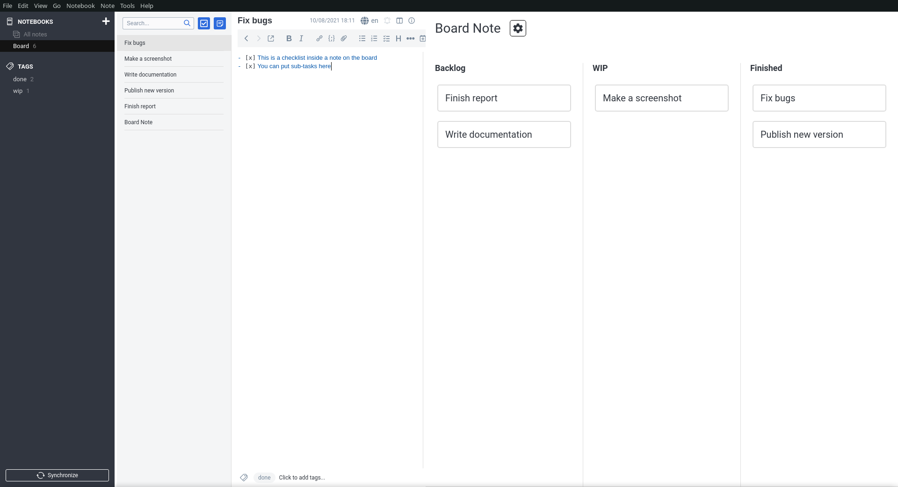

# Joplin KanMug Plugin

This is a fork of the original Joplin Kanban plugin, which was [archived](https://github.com/joplin/plugin-kanban/issues/57) on January 19, 2025 due to lack of maintainers. While the original plugin was deprecated in favor of YesYouKan plugin, this fork aims to provide an alternative by continuing development and maintenance of the original kanban functionality for Joplin.

> [!NOTE]  
> This plugin maintains compatibility with the original kanban plugin's file format. If you haven't used any new features from KanMug (e.g. newNoteTitle), you can switch between KanMug and the original Kanban plugin by enabling/disabling them in Joplin's plugin settings. Your kanban boards will work with any of these plugins.



## Installation

In Joplin, go to Tools > Options, then on the left select Plugins, search for "kanmug" and click install. You can read more about Joplin plugins [here](https://joplinapp.org/plugins/).

## Usage

To get started, you'll need a notebook which will contain all tasks that you want to see on the board. The plugin will only show tasks in a single notebook and it's sub-notebooks.

A kanban board is defined by a special type of note, which contains all of its configuration. Create a new note, and paste in the following:

    ```kanban
    columns:
      - name: Backlog
        backlog: true
      - name: Work in progress
        tag: wip
      - name: Finished
        tag: done
    ```

It is important that the confiuration is surrounded by a code block (` ```kanban ... ``` `), otherwise it won't be detected.

After pasting the configuration, you might have to switch to a different note, then back, but then you should immediately see a kanban view pop up on the right. It should contain all notes in the notebook, sorted into columns. You can drag the notes around and see that their tags are updated.

If you switch to a different note that's on the board, the kanban should stay visible. But if you switch to another notebook, or restart Joplin, you'll need to first open the note which contains the configuration again.

## Configuration

There are two ways to configure a kanban board: the YAML based text config ([a quick intro on YAML](https://learnxinyminutes.com/docs/yaml/)), that you see above, or the config dialog. The options available are the same with both methods.

### Columns

You can have any number of columns on your kanban board. A column is defined by its name (which must be unique) and a list of rules. These rules determine what notes show up in the given column. If _any one_ of the rules matches, the note is sorted into the column. Here's the list of supported rules:

* `tag: ...` Matches if the note has the given tag. If the tag doesn't exist, it is created automatically. You can also use `tags` to define a list tags.
* `notebookPath: ...` Matches if the note is in the notebook, defined by the path. You can read more about notebook paths below, in the filters section.
* `completed: true` Matches if the note is a todo and is marked as done. You can also use `completed: false` to match uncompleted todos.
* `backlog: true` Matches if the note doesn't fit into any other column. You can use this to collect all your unmarked notes.

You can edit these rules via the config dialog, by double clicking the column name.

### Filters

Filters are rules which define what notes should be visible on your board. For example, with the following config only notes with a `task` tag will show up on the kanban view:

```yaml
```kanban
filters:
  tag: task
columns:
...
```

Filters can contain the same rules as columns, except for the `rootNotebookPath` property. This defines the notebook from which notes are displayed on the board. By default, it is the parent notebook of the config note, but you can set it to anything. It's a `/` separated path so with a notebook structure like

```
Parent/
├─ Nested Parent/
│  ├─ Kanban board/
```

To give the path to `Kanban board` you should write `"Parent/Nested Parent/Kanban board"`

To edit the filters via the config dialog, click the gear icon next to the board name.

### Display

The kanban plugin automatically creates a static table view of your board on the configuration card. This is useful when you want to view your kanban board on a mobile device (which don't support plugins). You can change this to display as a list. 

```yaml
```kanban
filters:
  tag: task
columns:
...
display:
  markdown: list
```

Visual examples and more info: https://github.com/joplin/plugin-kanban/pull/19

### Sort

By default, the kanban plugin sorts each column based on the user's dragging and dropping of notes across the kanban board, with new notes going at the top. To specify a fixed sort pattern based on note properties instead, use the following config:

```yaml
```kanban
sort:
  by: title
```

Descending sort order may be specified by prefixing `-`, e.g., `-title`.

The configured sort order will apply to all columns.

### Managing Large Kanban Boards with Column Title Linking

A Kanban board may unintentionally grow into an overly large and complex structure, making it difficult to manage and navigate. For example, you might initially create a "Reference" column to store various resources, but later realize that further categorization is necessary to organize these materials effectively.

An oversized board is not ideal for management. To address this issue, you may fork a **Sub-Kanban** boards and create link to the original kanban.

The process is straightforward. When a column—such as "Resources"—needs further breakdown (e.g., into "Articles," "Diagrams," or "Design"), you can create a new Kanban board to accommodate the subcategories. In the original board, a column tile link can then be used to connect to the Sub-Kanban board.

**Example Structure:**

Original Kanban:
```
My Project
├─WIP
├─TODO
├─Backlog
├─Design
├─Diagram
└─Article
```

After introducing a Sub-Kanban:

```
My Project
├─Backlog
├─TODO
├─WIP
└─Resources # Click on the column title to open `My Project Resources` kanban

My Project Resources
├─Backlog # Click on the column title to open `My Project` kanban
├─Design
├─Diagram
└─Article
```

**Example Kanban Configurations:**

Main Board (`My Project`):

```yaml
```kanban
filters:
  rootNotebookPath: /
  tag: my_project
columns:
  - name: Backlog
    backlog: true
  - name: WIP
    tag: my_project/wip
  - name: TODO
    tag: my_project/todo
  - name: Resources
    tag: my_project/resources
    link: joplin://x-callback-url/openNote?id=740b762b425e4abb91f01aff11fc34b0
```

Sub-Board (`My Project Resources`):

```yaml
```kanban
filters:
  rootNotebookPath: /
  tag: my_project/resources
columns:
  - name: 🔙 Backlog
    backlog: true
    link: joplin://x-callback-url/openNote?id=b228ae0f49439473640712e7aaa5012c
  - name: Design
    tag: my_project/design
  - name: Diagram
    tag: my_project/diagram
  - name: Articles
    tag: my_project/article
```

**Notes:**

- The `link` field supports both external Joplin links (`joplin://`) and standard web URLs.


### New Note Title

You can use the `newNoteTitle` property to specify a template for the title of new notes. The template will be rendered using [EJS](https://ejs.co/) and will have access to the `today()` function, which will render the current date and time.

```yaml
```kanban
columns:
  - name: "Template Test"
    newNoteTitle: "New Task <%= today().add('1d').add('-7h').format('MM/dd') %>"
```

The title will be rendered as "New Task 01/31" if the current date is January 30, 2025 or January 31, 2025 before 07:00.

The `today()` returns the current date in the format `yyyy-MM-dd`.

You could modify the value by calling the `add` and `format` methods.

The `add` method takes a delta string as an argument. The delta string is a string that represents the time difference to add to the current date and time. For example, `'1d'` adds one day, `'1h'` adds one hour, etc. You may pass in a string like `'1d'` or `'1h'` or `'1m'` or `'1s'` or `'1ms'`. Negative values are also supported.

The `format` method takes a format string as an argument. The format string is a string that represents the format of the date and time to render. For example, `'MM/dd'` renders the date in the format `01/31`. The default format is `yyyy-MM-dd`. You may find available formats [here](https://github.com/moment/luxon/blob/master/docs/formatting.md#table-of-tokens)

Example usages:

```yaml
newNoteTitle: <%= today() %>
newNoteTitle: New Task <%= today().add('1d') %>
newNoteTitle: New Task <%= today().add('1d').add('-7h').format('MM/dd') %>
newNoteTitle: New Task <%= today().format('MM/dd') %>
```

Tips:

Let's say you have a kanban with a column for "Due Tomorrow". You want to create a new note on tomorrow's date. But you enjoy working in the midnight hour after 00:00, the actual newly note title will be 2 days from now. It looks weird for you. You can change the start time of a new note by adding a negative delta to the `today()` function.

```yaml
newNoteTitle: New Task <%= today().add('1d').add('-4h') %>
```
Add `-4h' if you think that a start time of a day is 04:00

## Troubleshooting

### Cannot Move Note Out of Any Folder. Please Review Your Kanban Configuration.

When configuring your Kanban board, if you specify a `notebookPath` for the Kanban settings but omit the `notebookPath` for one or more columns, the following issue can occur:

**Example**

```yaml
```kanban
filters:
  rootNotebookPath: /
  tag: column
columns:
  - name: Backlog
    backlog: true
  - name: Column1
    notebookPath: /column1
  - name: Column2
    tag: column2
```

In this configuration, moving a card from **Column1** to **Column2** would cause the associated note to be moved out of the `/column1` folder and placed directly under the root folder (`/`). 

This operation is problematic because many extensions—and even Joplin itself—may not handle such behavior correctly, leading to potential glitches. To prevent these issues, this type of operation is now explicitly forbidden. 

Please review and update your Kanban board configuration to ensure that all columns are properly set up to avoid triggering this restriction.

If you prefer a different behavior or have suggestions for improvement, feel free to open an issue on our [issue tracker](https://github.com/benlau/joplin-plugin-kanmug/issues) or participate in the discussion at the [Joplin Forum](https://discourse.joplinapp.org/t/kanmug-a-forked-project-of-the-original-kanban-plugin/43481).

## Further information

If you want to know more about the workings of the plugin or its development check out the [original proposal](https://discourse.joplinapp.org/t/kanban-board-project/17469) and the [progress reports](https://discourse.joplinapp.org/t/kanban-board-project/17469)

For an enhanced Joplin experience, I recommend using this plugin alongside [DDDot](https://github.com/benlau/joplin-plugin-dddot). DDDot provides useful features like:

- Recent notes tracking
- Note shortcuts
- Quick scratchpad
- And more...

All conveniently accessible from a single sidebar. DDDot works seamlessly with KanMug to improve your note organization and workflow in Joplin.
